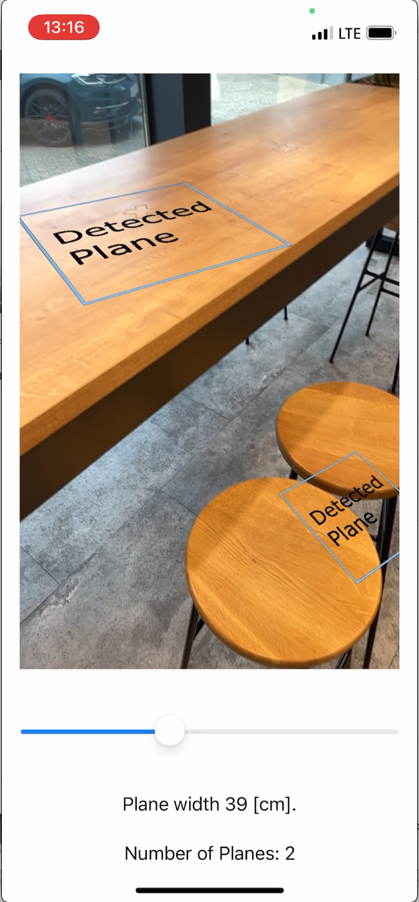
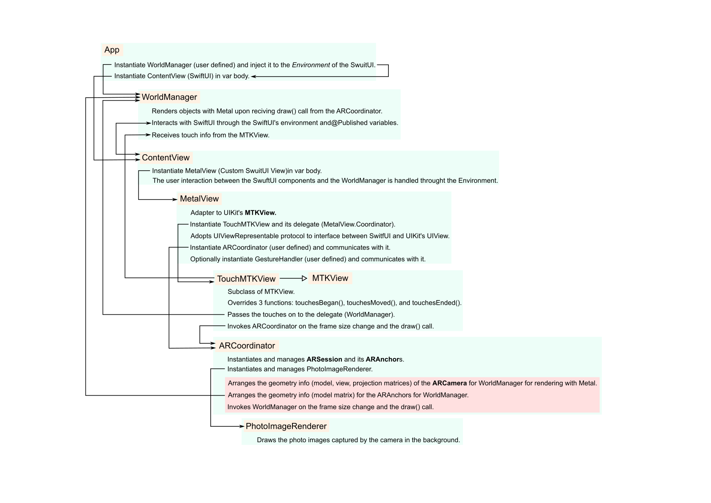

# Template XCode Project for ARKit, Metal, and SwiftUI (without Storyboard).

This is a barebone template XCode project that shows how to render the AR world with Metal shaders in SwiftUI, as opposed to Storyboard & Swift.
It shows how SwiftUI and the rendering part with ARKit & Metal can communicate with each other by showing how to control the size of the rectangles drawn on the screen with the SwiftUI's Slider.

[Demo Video](https://youtube.com/shorts/SDvFGOBvw2Y)

## Motivation
XCode (at least up to Version 14.0) does not provide a new project template for SwiftUI combined with Metal shaders or ARKit.
Also, as far as I know, there is not much information publicly available about how to use metal shaders with SwiftUI and ARKit.

The following thread at `developer.apple.com` seems to be the only source of informaton on how to use Metal with SwiftUI,
in which an internal developer of Apple gives a code snippet for a class *MetalView*, which wraps UIKit's MTKView for SwiftUI.
    [https://developer.apple.com/forums/thread/119112?answerId=654964022#654964022]
(https://developer.apple.com/forums/thread/119112?answerId=654964022#654964022])

This sample project is an attempt to use this MetalView in the AR environment with SwiftUI.

## Class Overview
The following chart shows all the relevant Classes and their interactions.
The starting point is `ARWithMetalAndSwiftUIApp` and it should be reasonably straightforward to walk through the code from there.
Additional comments are given in the code where appropriate.

## Some Things to Note

### Coordinate conversion.
ARKit uses the ordinary left-hand coordinate system while Metal expects the right-hand coordinate system. A conversion is needed at the interface between thsoe two. See the parts marked with `Coordinate conversion` in `WorldManager.swift`.

### Device Orientation
It seems the device orientatoin should be fixed to one of four.
The sample code is hardcoded for "Portrait". Change the following parts when you want to change the orientation.

- info.plist Supported interface orientations : Portrait (bottom home button)

- The parts in code marked with `Device Orientation` in `ARCoordinator.swift` and `PhotoImageRenderer.swift`.

# License
CCBY 2.0. The code contained in this repo is based on the following two: 

- Code for a class *MetalView* posted by *Graphics and Games Engineer*
 in [https://developer.apple.com/forums/thread/119112?answerId=654964022#654964022](https://developer.apple.com/forums/thread/119112?answerId=654964022#654964022)

- The template code generated by Xcode Version 14.0 by selecting *New->Project->iOS/Augmented Reality App, Interface: Storyboard, Language: Swift, Content Technology: Metal*.

# Create an equivalent project from scratch.
1. Launch XCode (I used Xcode 14.0 on Macbook Pro 2017, MacOS 12.5.1
2. File -> New -> Project...
3. Application, iOS, App, and click "Next".
4. Product Name: ARWithMetalAndSwiftUI, Interface: SwiftUI, Language Swift, click Next and Create.
5. Go to "TARGETS", "General", and "Frameworks, Libraries, and Embedded Content, and add "ARKit", and "MetakKit"
6. Go to "TARGETS", "General", and "Minimum Deployments" and adjust iOS for your iOS devices.
7. Go to "TARGETS", "General", and "Deployment Info" and uncheck everything except "Portrait".
8. Go to "TARGETS", "Info", and edit "Supported interface orientations" to: "Portrait (bottom home button)". Do the same for "Supported interface orientations (iOS)" and "Supported interface orientations (iPad)" if necessary.
9. Go to "TARGETS", "Info", and edit "Privacy - Camera Usage Description" to something like "This App uses the rear camera for the AR experience."
10. Replace the content of ARWithMetalAndSwiftUIApp.swift with the one in the repo.
11. Replace the content of ContentView.swift with the one in the repo.
12. Add the following files to the project checking "Copy items if needed".
	* ARCoordnator.swift
	* MetalView.swift
	* ShaderBarebone.metal
	* ShaderCameraImage.metal
	* TouchMTKView.swift
	* Utils.swift
	* WorldManager.swift
	* Textures.scassets/
13. Build & Enjoy! 

